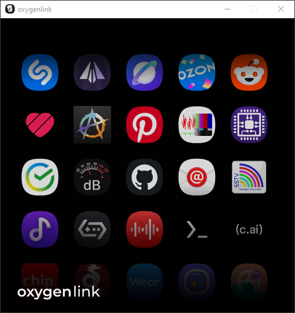
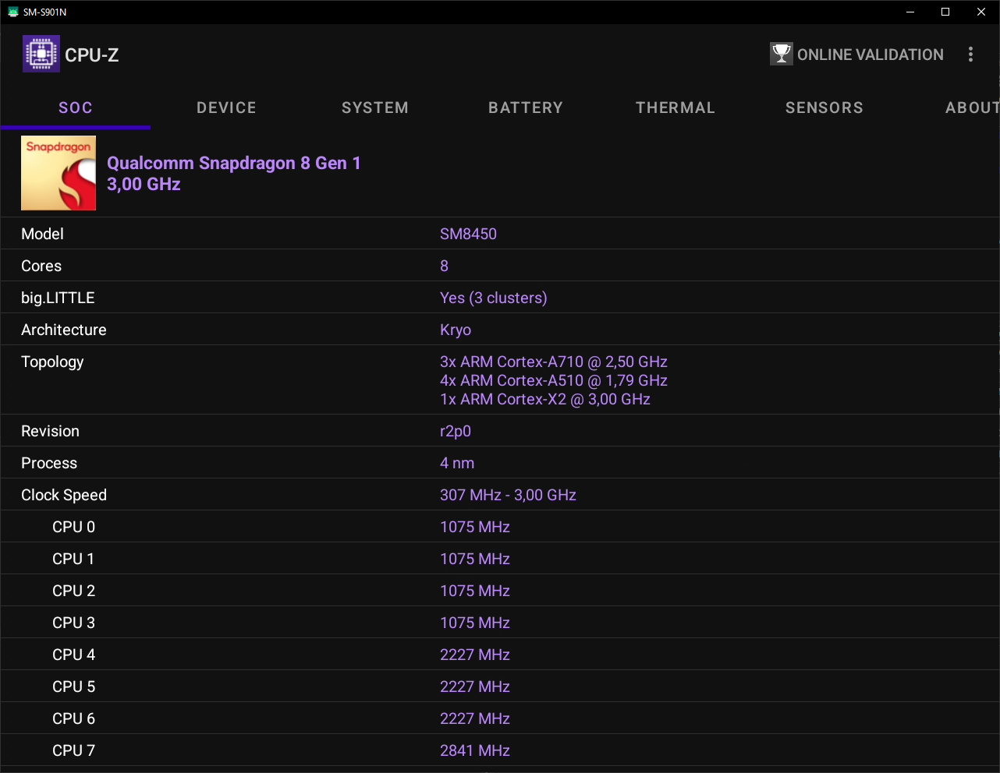

# oxygenlink
### [ Русский ](drawable/readme/rus.md)
A lightweight desktop **scrcpy** launcher to open apps from your **Android** phone as resizable windows on your PC.
<table>
  <tr>
    <td></td>
    <td></td>
  </tr>
</table>

## Installation

### To install launcher you will need:
- Download and install ADB drivers **(optional)** 
- Download and install your phone's USB drivers
- Download and unzip latest release of the **oxygenlink**
- Enable USB debugging on your device
#### Step 1. Getting ADB drivers **(optional)** 
1. Go to [clockworkmod ADB drivers page](https://adb.clockworkmod.com/)
2. Download .msi installer
3. Install the driver.
#### Step 2. Getting your device's USB drivers
This step depends on your phone manufacturer. 
Simply google **"(your phone brand) USB drivers"**, then download and install them.
#### Step 3. Downloading the app
1. Go to [Releases](https://github.com/kafelbb/oxygenlink/releases) page.
2. Grab .zip (or .7z) archive from the latest release
3. Unzip it into folder (e.g `Desktop/apps/`)
4. Move the **shortcut** file **(oxygenlink.lnk)** to your desktop.
#### Step 4. Enabling USB debugging
This step also depends on your phone manufacturer. 
Google **"(your phone brand) how to enable USB debugging"**

### Usage
#### After you are done installing **oxygenlink**, you can finally run it.
 But when using the app, you should **always** keep your phone connected to your PC, otherwise **scrcpy** would not stream your app and its audio to your PC.
 #### Important!
 After you launch **oxygenlink** for the first time, you will need to wait 5-10 minutes for the program to grab all of your app icons and cache them
  **Do not** remove *cached/* directory, or you will need to wait again for the program to grab icons.
 Also make sure that your phone is unlocked when you use the prog
### Compiling
#### If you want to compile this abomination, here's how to do it:
1. Install Java Development Kit 21
2. Download **Android Studio** and install it
3. Install **Command Line tools**  And **SDK manager** via *More Actions* on the Android Studio welcome screen.
4. Edit **/src/build_oxyconnect.bat** batch file to link the command-line tools
5. Run the batch file you just edited
6. After it finishes the **oxyconnect.java** helper class, **open Microsoft Visual Studio** (or any your favourite IDE)
7. Generate CMake cache
8. Build oxygenconnect.exe (either via x64-Debug or x64-Release config)
1. Download the latest scrcpy release
1. Unzip it into the tools folder
1. Rename scrcpy-0.6.7 (or whatever) folder to just scrcpy

## Troubleshooting

### Black screen after launching the app
#### If this happens after manual compilation:
1. Kill adb.exe via Task Manager.
2. Check the /tools folder. If there are only 3 files inside (adb.exe and two .dll files), manually copy the entire /tools folder from the project root directory into your build directory (e.g., out/x64-Debug).

#### If you downloaded a pre-built release:
1. Go back to the [Releases](https://github.com) page and download the previous version (if there is one).
2. Delete the broken version.
3. Unzip the downloaded archive and run the prog.

### The logo is visible, but no apps are showing up:
1. Make sure you have installed the ADB drivers.
2. Make sure you have installed the USB drivers for your Android device.
3. Check your USB cable connection (and ensure your phone is actually plugged into the PC).
4. Open **Device Manager** on your PC and check if there are any unknown USB devices marked with a yellow exclamation mark icon.
5. Check if you enabled USB-debugging on your Android device and allowed your PC
### "Folder in use" error when trying to delete a directory:
1. Open **Task Manager**.
2. Go to the **Details** tab.
3. Find `adb.exe` in the list.
4. Kill the process.

> **Note:** This happens because the Android Debug Bridge (ADB), which the app uses to connect to your phone, runs as a background daemon. It stays active so that any other app trying to run an ADB command can do so instantly, without waiting for a lengthy ADB initialization.
