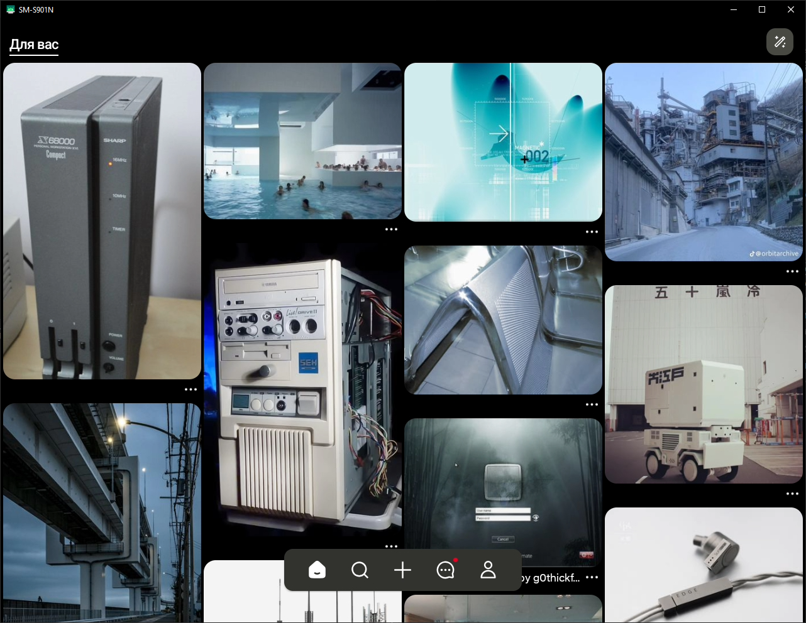

# oxygenlink
### [ English ](../../README.md)

Легкий лаунчер для **scrcpy**, который позволяет открывать приложения с **Android-устройств** в виде полноценных масштабируемых окон на ПК.

<table>
  <tr>
    <td></td>
    <td></td>
    <td></td>
  </tr>
</table>

## Установка

### Чтобы установить лаунчер, надо:
- Скачать и установить ADB-драйверы **(необязательно)** 
- Скачать и установить USB-драйверы для вашего телефона
- Скачать и распаковать последнюю версию **oxygenlink**
- Включить USB отладку на устройстве

#### Первое. Установка ADB-драйверов **(необязательно)** 
1. Перейди на [страницу ADB-драйверов clockworkmod](https://clockworkmod.com).
2. Скачай .msi установщик.
3. Установи драйвер.

#### Второе. Установка USB-драйверов
Тут все зависит от марки устройства.
Просто загугли **"(марка вашего телефона) USB drivers"**, скачай и установи дрова.

#### Третье. Скачивание приложения
1. Перейди на страницу [Releases](https://github.com).
2. Скачай .zip (или .7z) архив последнего релиза.
3. Распакуй его в какую-нибудь папку (например, `Desktop/apps/`).
4. Перемести **ярлык** **(oxygenlink.lnk)** на рабочий стол.

#### Четвертое. Установка USB-драйверов
Тут все тоже зависит от марки устройства.
Просто загугли **"(марка вашего телефона) как включить USB отладку"**

## Использование

После завершения установки можно наконец-то запустить прогу. 

При использовании oxygenlink устройство **всегда** должно быть подключено к ПК, иначе **scrcpy** не сможет стримить приложения.

#### Важно!
* После первого запуска прога будет тащить иконки приложений с устройства. Это займет 5-10 минут.
* **Не удаляй** папку cached/, иначе придется снова ждать, пока программа заново вытащит все иконки.
* Также необходимо держать телефон разблокированным, чтобы и стриминг работал, и управлять приложением можно было

## Компиляция

#### А если ты мазохист, то:
1. Установи Java Development Kit (JDK) 21.
2. Скачай и установи **Android Studio**.
3. Установи **Command Line tools** и **SDK manager** через меню *More Actions* на главном экране Android Studio.
4. Отредактируй батник /src/build_oxyconnect.bat, чтобы указать путь к command-line tools.
5. Запусти этот батник.
6. После того как он закончит компиляцию хелпера oxyconnect.java, **открой Microsoft Visual Studio** (или любую другую IDE).
7. Сгенерируй кэш CMake.
8. Скомпилируй oxygenconnect.exe (через конфигурацию x64-Debug или x64-Release).
9. Скачай последний релиз scrcpy
1. Распакуй его в папку tools
1. Переименуй папку scrcpy-0.6.7 (или что там будет) в scrcpy

## Баги

### Если после запуска проги видно просто черный экран
#### Если после ручной компиляции:
1. Кильни adb.exe в диспетчере задач
1. Чекни папку /tools, если там лежит всего 3 файла (adb.exe и .dll), то вручную перетащи папку /tools из корневой директории проекта в папку компила (out/x64-Debug например)
#### Если ты скачал готовый релиз с [Releases](https://github.com):
1. Скачай предыдущую версию на той же странице [Releases](https://github.com)
1. Удали нерабочую версию
1. Распакуй только что скачанный архив и запусти прогу
### Если показывает логотип, но нету приложений:
1. Чекни установил ли ты драйвера на ADB
1. Чекни установил ли ты драйвера для своего устройства
1. Чекни состояние USB кабеля, которым ты подключаешь устройство к компу (если ты вообще его подключил)
1. Чекни **Диспетчер Устройств** и посмотри, нету ли никакого неизвестного USB-устройства с восклицательным знаком на значке
2. Включи USB отладку на устройстве и дай разрешение на отладку своему ПК (при подключении должно показать соответствующее окно)
### Если при удалении папки пишет, что папка занята уже запущенным файлом:
1. Запусти Диспетчер Задач
1. Перейди в **Подробности**
1. Найди adb.exe
1. И кильни этот процесс
> К слову происходит это из-за того, что Android Debug Bridge (ADB), который использует прога для подключения к телефону, запускается как daemon-server, чтобы любая другая прога, которая хочет выполнить команду через ADB, могла это сделать быстро, а не ждать долгой инициализации ADB.
